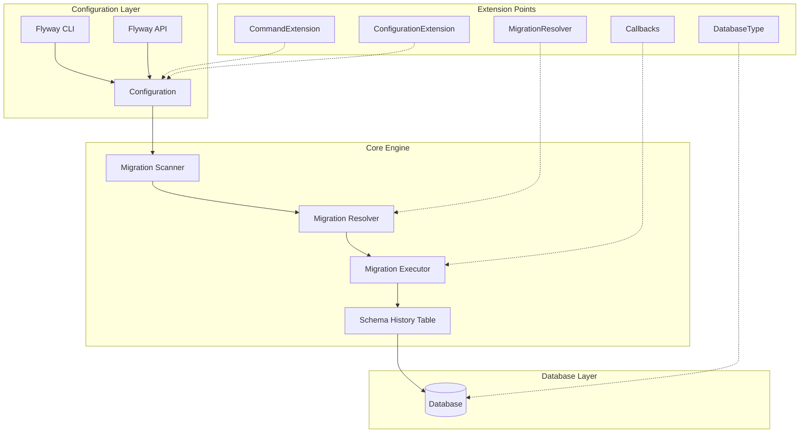
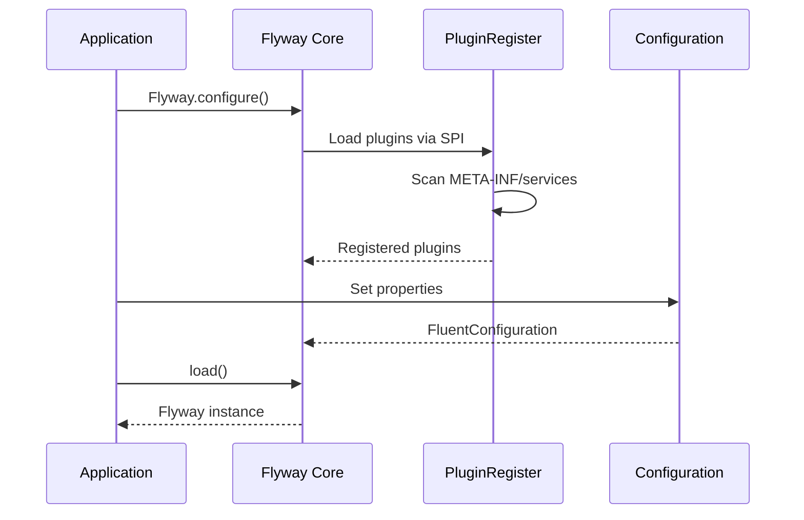
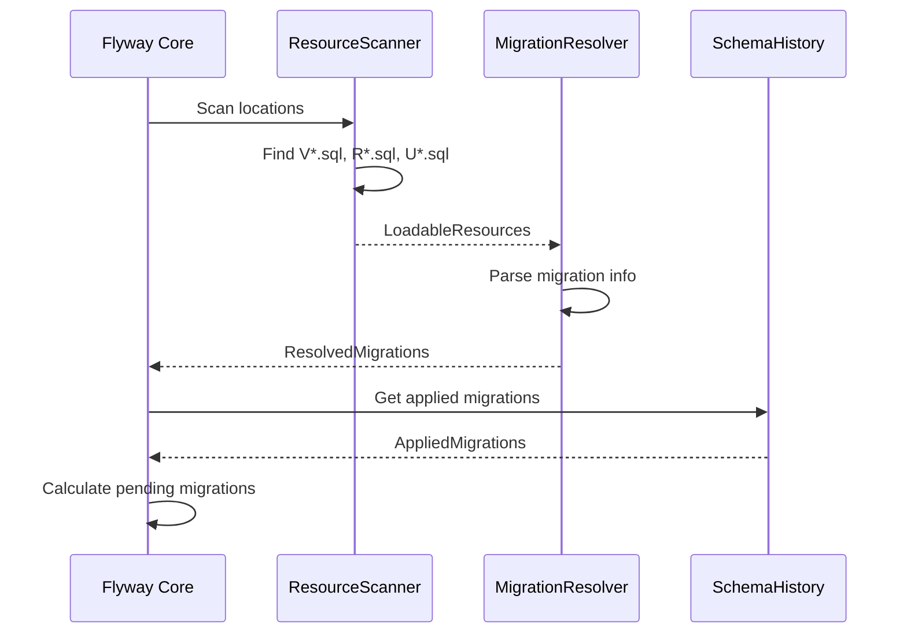
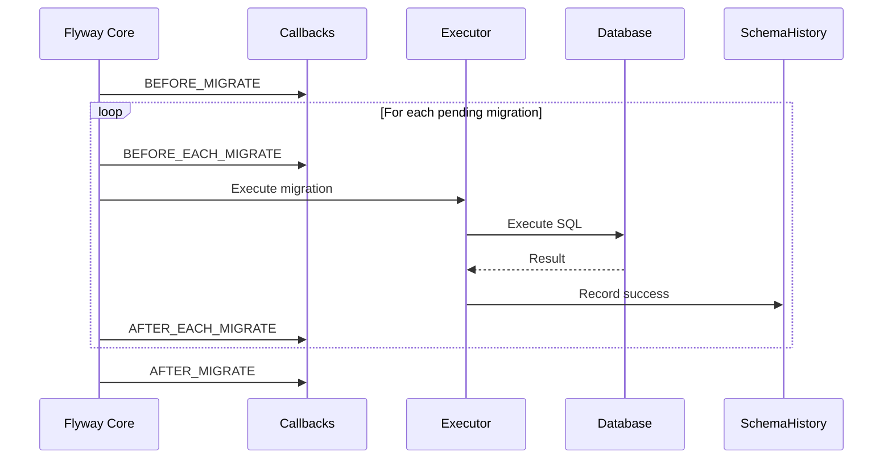
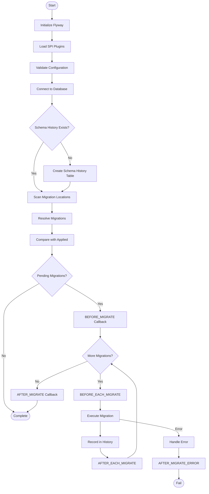
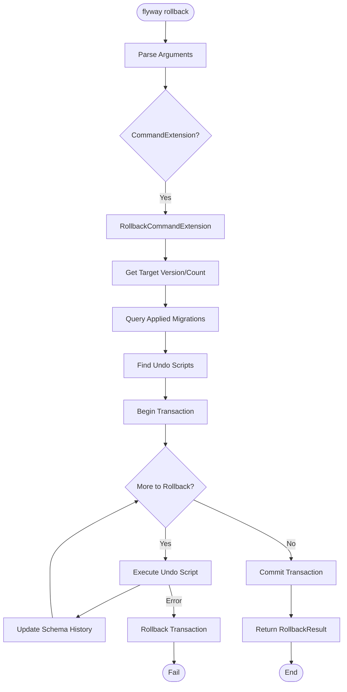

# Flyway Lifecycle and SPI Guide

This guide explains the complete Flyway lifecycle, extension points (SPIs), and end-to-end migration flow.

## Table of Contents

1. [Flyway Architecture Overview](#flyway-architecture-overview)
2. [Migration Lifecycle](#migration-lifecycle)
3. [Service Provider Interfaces (SPIs)](#service-provider-interfaces-spis)
4. [End-to-End Flow](#end-to-end-flow)
5. [Extension Examples](#extension-examples)

---

## Flyway Architecture Overview



---

## Migration Lifecycle

### Phase 1: Initialization



### Phase 2: Migration Discovery



### Phase 3: Migration Execution



---

## Service Provider Interfaces (SPIs)

Flyway uses Java's ServiceLoader mechanism. Extensions are registered in:
```
META-INF/services/org.flywaydb.core.extensibility.<Interface>
```

### 1. Plugin (Base Interface)

All Flyway extensions implement the `Plugin` interface:

```java
package org.flywaydb.core.extensibility;

public interface Plugin {
    // Base marker interface
}
```

**Service File:** `META-INF/services/org.flywaydb.core.extensibility.Plugin`

---

### 2. CommandExtension

Add custom commands to Flyway CLI (e.g., `flyway rollback`).

```java
public interface CommandExtension extends Plugin {
    // Check if this extension handles the command
    boolean handlesCommand(String command);
    
    // Check if this extension handles the parameter
    boolean handlesParameter(String parameter);
    
    // Execute the command
    OperationResultBase handle(String command, 
                               Map<String, String> config,
                               List<String> flags) throws FlywayException;
}
```

**Service File:** `META-INF/services/org.flywaydb.core.extensibility.CommandExtension`

**Example Registration:**
```
org.flywaydbextended.extension.RollbackCommandExtension
```

---

### 3. ConfigurationExtension

Add custom configuration options.

```java
public interface ConfigurationExtension extends Plugin {
    // Get the namespace for this extension's config
    String getNamespace();
    
    // Get configuration key
    String getConfigurationParameterFromEnvironmentVariable(String envVar);
}
```

**Service File:** `META-INF/services/org.flywaydb.core.extensibility.Plugin`

---

### 4. Callback

Hook into migration lifecycle events.

```java
public interface Callback {
    // Check if callback supports this event
    boolean supports(Event event, Context context);
    
    // Can this run in a transaction?
    boolean canHandleInTransaction(Event event, Context context);
    
    // Handle the event
    void handle(Event event, Context context);
    
    // Get callback name for logging
    String getCallbackName();
}
```

**Available Events:**
| Event | Description |
|-------|-------------|
| `BEFORE_CLEAN` | Before the clean operation |
| `AFTER_CLEAN` | After the clean operation |
| `BEFORE_MIGRATE` | Before migration starts |
| `BEFORE_EACH_MIGRATE` | Before each migration |
| `AFTER_EACH_MIGRATE` | After each migration |
| `AFTER_MIGRATE` | After all migrations complete |
| `BEFORE_UNDO` | Before undo operation |
| `AFTER_UNDO` | After undo operation |
| `BEFORE_REPAIR` | Before repair operation |
| `AFTER_REPAIR` | After repair operation |
| `BEFORE_INFO` | Before info operation |
| `AFTER_INFO` | After info operation |
| `BEFORE_VALIDATE` | Before validate operation |
| `AFTER_VALIDATE` | After validate operation |
| `BEFORE_BASELINE` | Before baseline operation |
| `AFTER_BASELINE` | After baseline operation |

---

### 5. MigrationResolver

Custom migration discovery and resolution.

```java
public interface MigrationResolver {
    // Resolve migrations from a location
    Collection<ResolvedMigration> resolveMigrations(Context context);
}
```

**Use Cases:**
- Custom migration formats (JSON, YAML)
- External migration sources
- Dynamic migration generation

---

### 6. StatementInterceptor

Intercept SQL statements during execution.

```java
public interface StatementInterceptor {
    void init(Database database, Table table);
    void close();
    void sqlScript(LoadableResource resource);
    void sqlStatement(SqlStatement statement);
    void schemaHistoryTableCreate(boolean baseline);
    void schemaHistoryTableInsert(AppliedMigration appliedMigration);
    void interceptCommand(String command);
    void interceptStatement(String sql);
    void interceptPreparedStatement(String sql, Map<Integer, Object> params);
    void interceptCallableStatement(String sql);
}
```

> **Note:** `StatementInterceptor` is **not** a subtype of `Plugin`. It requires separate registration.

---

### 7. DatabaseType

Add support for new database types.

```java
public interface DatabaseType extends Plugin {
    String getName();
    int getNullType();
    boolean handlesJDBCUrl(String url);
    String getDriverClass(String url, ClassLoader classLoader);
    boolean handlesDatabaseProductNameAndVersion(String product, String version, Connection conn);
    Database createDatabase(Configuration config, JdbcConnectionFactory factory, ...);
}
```

---

## End-to-End Flow

### Complete Migration Flow



### Rollback Flow (Custom Extension)



---

## Extension Examples

### This Project's Extensions

| Extension | Type | Purpose |
|-----------|------|---------|
| `RollbackCommandExtension` | CommandExtension | Adds `flyway rollback` command |
| `RollbackConfigurationExtension` | ConfigurationExtension | Adds rollback configuration options |
| `ResultOutputConfiguration` | ConfigurationExtension | Configures result output format |
| `ResultOutputCallback` | Callback | Saves operation results to file |

### Service Registration

**File:** `META-INF/services/org.flywaydb.core.extensibility.Plugin`
```
org.flywaydbextended.extension.RollbackCommandExtension
org.flywaydbextended.config.RollbackConfigurationExtension
org.flywaydbextended.reporting.ResultOutputConfiguration
```

**File:** `META-INF/services/org.flywaydb.core.extensibility.CommandExtension`
```
org.flywaydbextended.extension.RollbackCommandExtension
```

---

## Quick Reference

### Migration Naming Conventions

| Prefix | Type | Description |
|--------|------|-------------|
| `V` | Versioned | One-time migrations (e.g., `V1__Create_table.sql`) |
| `U` | Undo | Undo migrations (e.g., `U1__Undo_create_table.sql`) |
| `R` | Repeatable | Run when changed (e.g., `R__Refresh_view.sql`) |

### Configuration Priority (Highest to Lowest)

1. Programmatic API configuration
2. Command-line arguments
3. Environment variables
4. Config files (`flyway.conf`)
5. Default values

### Schema History Table Columns

| Column | Type | Description |
|--------|------|-------------|
| `installed_rank` | INT | Unique order of execution |
| `version` | VARCHAR | Migration version |
| `description` | VARCHAR | Migration description |
| `type` | VARCHAR | SQL, JDBC, etc. |
| `script` | VARCHAR | Script filename |
| `checksum` | INT | CRC32 checksum |
| `installed_by` | VARCHAR | User who ran it |
| `installed_on` | TIMESTAMP | When it was run |
| `execution_time` | INT | Duration in ms |
| `success` | BOOLEAN | Success flag |

### Extended Columns (This Project)

| Column | Type | Description |
|--------|------|-------------|
| `rolled_back` | BOOLEAN | If migration was rolled back |
| `rollback_date` | TIMESTAMP | When rollback occurred |
| `rollback_user` | VARCHAR | Who performed rollback |
| `rollback_reason` | VARCHAR | Reason for rollback |

---

## See Also

- [EXTENSIONS.md](EXTENSIONS.md) - Extension implementation details
- [SPI_SERVICES_GUIDE.md](SPI_SERVICES_GUIDE.md) - SPI registration guide
- [COMMAND_EXTENSION_GUIDE.md](COMMAND_EXTENSION_GUIDE.md) - Custom command guide
- [Flyway Documentation](https://flywaydb.org/documentation/)
